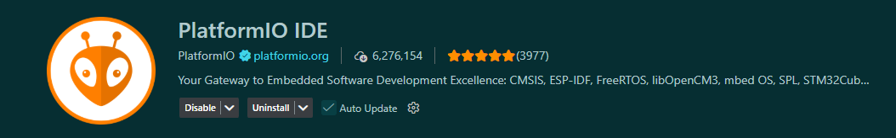
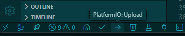
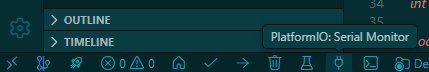

# Manuel Utilisateur

## Installation et déploiement

Ce document décrit les procédures techniques pour flasher le microcontrôleur **ESP32** et déployer l'application mobile de monitoring.

### Flashage du Firmware sur ESP32

Le projet Le projet utilise PlatformIO pour la gestion du firmware, comme indiqué par le fichier de configuration `firmware/platformio.ini`.

#### Prérequis logiciels

- Installer [PlatformIO](https://platformio.org/install/ide?install=vscode) (extension pour VSCode recommandée).

- Avoir les drivers USB pour ESP32 installés.

#### Étapes de flashage

- Ouvrir le dossier firmware dans VSCode avec PlatformIO.
- PlatformIO détectera automatiquement le fichier `platformio.ini`.
- Connecter l'ESP32 via USB à l'ordinateur.
- Lorsque vous êtes prêt à flasher, placer vous sur le fichier `src/main.cpp` et cliquer sur l'icône "Upload" dans la barre d'outils en bas de VSCode.

- Attendre la fin du processus de compilation et de flashage. Vous verrez les logs dans la console PlatformIO.
- Pour vérifier que le firmware fonctionne, ouvrez le moniteur série en cliquant sur l'icône "Serial Monitor" dans la barre d'outils afin de voir les messages de debug.



*Note: Il est possible selon votre configuration machine que vscode n'ai pas les droits nécessaires pour accéder au port série. Dans ce cas, vous pouvez utiliser une solution immédiate mais pas très sécurisée:*

```bash
sudo chmod 666 /dev/ttyUSB0
```

*Remplacez `/dev/ttyUSB0` par le port série correspondant à votre ESP32.*

### Lancement de l'application mobile (Mode développement)

L'application mobile est développée avec React Native. Voici comment la lancer en mode développement.

#### Prérequis logiciels

- Installer [Node.js](https://nodejs.org/) version 20 ou supérieure sur votre machine.
- Installer JDK 17 pour être compatible avec gradle.
- Installer Android Studio pour émuler un appareil Android ou utiliser un appareil physique.

#### Installation des dépendances

- Ouvrir un terminal et naviguer vers le dossier `mobile`.
- Exécuter la commande suivante pour installer les dépendances :
  ```bash
  npm install
  ```

#### Lancement de l'application

Vous avez besoin de deux terminaux :

1. Dans le premier terminal, toujours dans le dossier `mobile`, lancer le serveur Metro avec la commande :
   ```bash
   npm start
   ```

2. Dans le second terminal, lancer l'application sur un émulateur ou un appareil connecté avec la commande :
   ```bash
    npm run android
    ```

*Note : Assurez-vous qu'Android Studio est lancé avec un émulateur lancé ou un téléphone Android branché avec le "Débogage USB" activé.*

L'application devrait se lancer sur l'émulateur ou l'appareil connecté. Vous pouvez maintenant interagir avec l'application mobile pour le monitoring et le contrôle de la ventilation.

#### Génération d'un APK pour distribution

Si vous souhaitez installer l'application sur un téléphone sans utiliser le mode développement (usage "client"), vous devez générer un fichier APK.

1. Générer l'APK en mode release avec la commande :
   ```bash
   cd android
   ./gradlew assembleRelease
   ```
2. L'APK généré se trouvera dans le dossier `android/app/build/outputs/apk/release/`. Vous pouvez l'installer sur un appareil Android soit:
   - En le transférant via USB et en l'ouvrant sur l'appareil.
   - Avec adbr sideloading :
     ```bash
     adb install -r mobile/android/app/build/outputs/apk/release/app-release.apk
     ```

L'application devrait maintenant être installée et prête à l'emploi sur votre appareil Android.